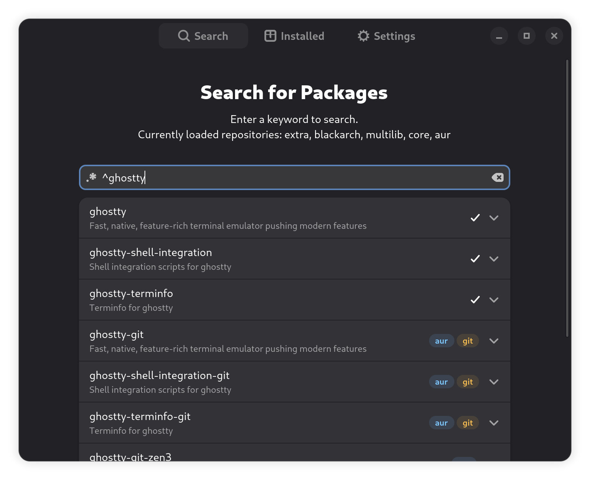

<h1 align="center">Packages</h1>

A simple GTK+ application to manage packages from Arch Linux and community repositories.

<p align="center">
  
</p>

## Installation

> ⚠️ Note: The project is currently in alpha. Features may be incomplete and bugs are expected.

---

## Development

Follow these steps to set up a development environment and run the project:

```bash
# Clone the repository
git clone https://github.com/tokyob0t/Packages.git
cd Packages/

# Create and activate a virtual environment
python -m venv venv
source venv/bin/activate

# Install Python dependencies
pip install -r requirements.txt

# (Optional) Install development tools
pip install -r requirements-dev.txt

# Run the project
sh scripts/run
```

Other scripts:

| Script            | Description                      |
| ----------------- | -------------------------------- |
| `scripts/run`     | Main entry point (calls `build`) |
| `scripts/build`   | Build or prepare packages        |

---

## Dependencies

Install Python dependencies first:

```bash
pip install -r requirements.txt
```

Optional development tools:

```bash
pip install -r requirements-dev.txt
```

System dependencies for GTK4 on Arch:

```bash
sudo pacman -S gtk4 gobject-introspection python-gobject meson ninja
```

---

## Contributing

Contributions are welcome! You can help by:

* Reporting bugs
* Improving scripts
* Adding features or translations

Please fork the [repo](https://github.com/tokyob0t/Packages), make changes, and submit a pull request.
